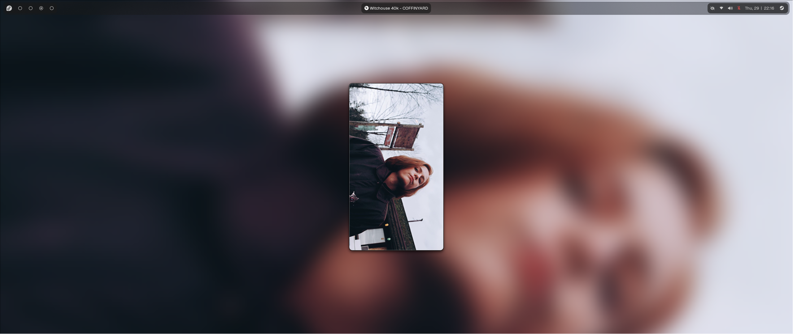
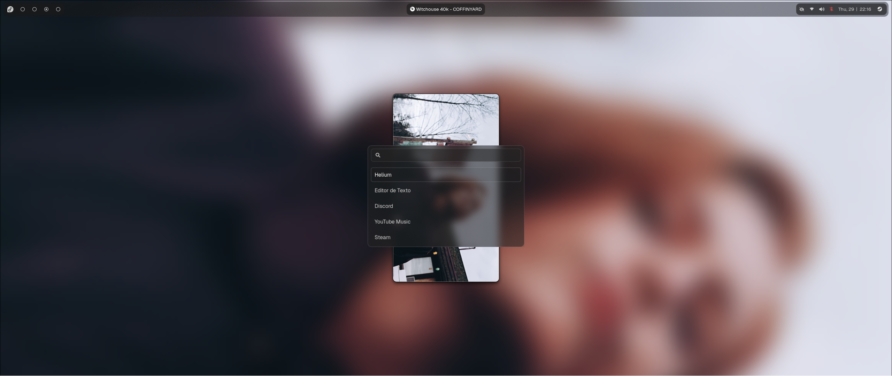
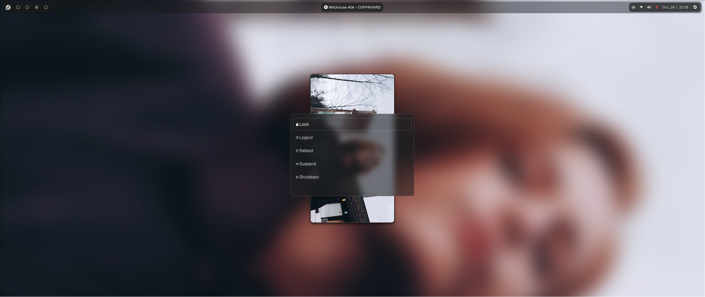
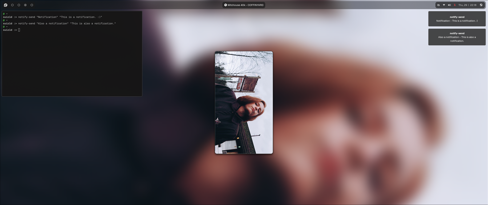

# dotfiles
my personal hyprland dotfiles

### screenshots 
<p></p>
<details>
<summary><i>click to show more images</i></summary>
  <p></p>
  <p></p>
  <p></p>
  <p></p>
</details>

**wallpaper by**: <a href="https://otvv.github.io/wallpaperize">🌆 wallpaperize!</a>

### dependencies

```txt
# The bare minimum for Hyprland/dotfiles to work properly

hyprland
hyprpaper
hyprpicker
hyprlock
hyprsunset
hypridle
waybar
wofi
dunst
lxqt-policykit  # (or any other polkit agent you prefer)
nm-connection-editor
blueman-manager

# Other dependencies

ImageMagick
fuse
MangoHud
blueman-nautilus
pactl
htop
qt5ct
qt6ct

# Software needed (you can change them if you want too,
# just chage the app that you want where it's referenced)

better-control # https://github.com/better-ecosystem/better-control
gnome-calendar
gnome-system-monitor
nautilus
pwvucontrol
docker
ghostty


```
